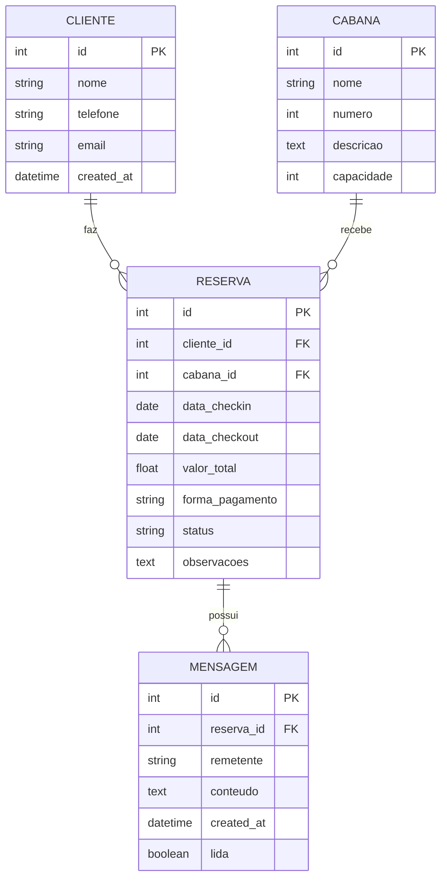

# Documentação Técnica - Cabanas Gestão

## 🏗️ Arquitetura do Sistema

O sistema segue uma arquitetura cliente-servidor desacoplada:

1.  **Frontend (Next.js 15):** Responsável pela interface do usuário, utilizando SSR (Server Side Rendering) e CSR (Client Side Rendering) via React Query para gerenciar o estado da API.
2.  **Backend (FastAPI):** Uma API RESTful que gerencia a lógica de negócios, validações de data e persistência.
3.  **Banco de Dados (SQLite):** Banco de dados relacional leve, ideal para a escala de gestão de 3 unidades.

---

## 📊 Modelo de Dados (Diagrama ER)

---

## 🔄 Fluxos Principais

### 1. Criação de Reserva e Conflito
Quando uma reserva é solicitada, o backend executa a seguinte query de validação:
`novo_checkin < reserva_checkout AND novo_checkout > reserva_checkin`
Se qualquer registro for retornado para a mesma cabana, o sistema bloqueia a criação e retorna um erro 400.

### 2. Gestão de Status
Os status seguem o fluxo:
`pendente` -> `confirmada` -> `concluída` (ou `cancelada`).
Reservas canceladas liberam as datas no calendário automaticamente.

---

## 🛠️ Variáveis de Ambiente

### Backend (`backend/.env`)
- `DATABASE_URL`: String de conexão (ex: `sqlite:///./sql_app.db`).
- `PORT`: Porta de execução (padrão 8000).

### Frontend (`frontend/.env.local`)
- `NEXT_PUBLIC_API_URL`: URL base da API (ex: `http://localhost:8000`).
